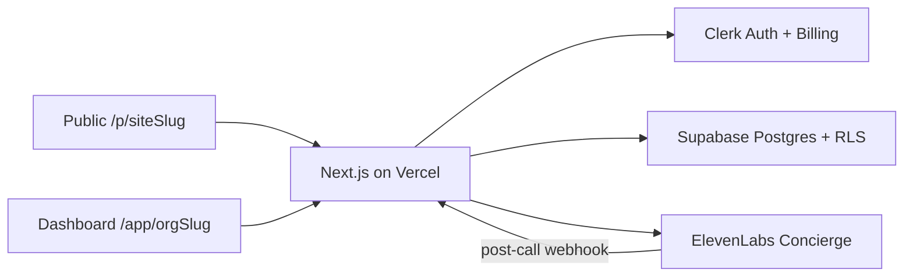

# flippinCalendar — AI Receptionist & Front-Desk SaaS

[](https://nextjs.org/)
[](https://supabase.com/)
[](https://go.clerk.com/IVUd0XO)
[](https://elevenlabs.io/)
[](https://tailwindcss.com/)
[](https://www.typescriptlang.org/)

A multi-tenant **AI front-desk / receptionist SaaS**: branded public booking pages, an ElevenLabs voice + text concierge that books appointments live, and a tenant-scoped staff dashboard.

> **Stack** — Next.js 16 App Router · React 19 · Supabase Postgres + RLS · Clerk auth + organizations + B2B billing · ElevenLabs Conversational AI · shadcn/ui · Tailwind CSS v4 · TypeScript strict

**Production domain:** [`flippincalendar.co.za`](https://flippincalendar.co.za) — cutover checklist in [`docs/production-readiness.md`](docs/production-readiness.md).

---

## Accounts you need

| Service | Role |
| ------- | ---- |
| [Clerk](https://go.clerk.com/IVUd0XO) | Auth, organizations, billing |
| [Supabase](https://supabase.com/) | Postgres + Row Level Security |
| [ElevenLabs](https://elevenlabs.io/) | Shared Concierge voice/text agent |
| [Vercel](https://vercel.com) _(optional)_ | Hosting |

---

## Two identity worlds

- **Dashboard** (`/app/[orgSlug]`) — staff signed in with Clerk Organizations. One org → one workspace.
- **Public page** (`/p/[siteSlug]`) — anonymous visitors booking. No Clerk session. Public API routes + RLS-safe reads only.

One **shared ElevenLabs Concierge** serves every tenant. Per-org persona, voice, greeting, and knowledge are injected at **session time** (signed URL + dynamic variables + overrides). Do **not** PATCH the shared agent per organization.

---

## Plans (ZAR)

| Plan | Clerk key | Price | AI |
| ---- | --------- | ----- | -- |
| Core | `free_org` | R0 | Locked — no AI agent |
| Pro | `engage` | R249/mo | Web chat (`web_agent`) |
| Voice | `voice` | R699/mo | Web chat + browser voice + analytics |

---

## Quick start

```bash
pnpm install
cp .env.example .env.local
# Fill Supabase, Clerk (Development), ElevenLabs, NEXT_PUBLIC_APP_URL
pnpm run clerk:rbac   # Hobby RBAC permissions/roles
pnpm dev
```

### Required env (see `.env.example`)

```bash
NEXT_PUBLIC_SUPABASE_URL=
NEXT_PUBLIC_SUPABASE_PUBLISHABLE_KEY=
SUPABASE_SECRET_KEY=

NEXT_PUBLIC_CLERK_PUBLISHABLE_KEY=pk_test_...
CLERK_SECRET_KEY=sk_test_...
NEXT_PUBLIC_APP_URL=http://localhost:3000

ELEVENLABS_API_KEY=
ELEVENLABS_DEFAULT_AGENT_ID=
ELEVENLABS_WEBHOOK_SECRET=
```

Apply SQL migrations from `supabase/migrations/` in the Supabase SQL editor or CLI before first run.

---

## Architecture



- **Auth / billing:** Clerk only — no Stripe mirror.
- **Data:** Supabase with tenant-scoped RLS (`organization_id` / Clerk `org_id`).
- **Concierge:** Versioned config under `agent_configs/` + `agents.json`; session routes under `/api/app/agent-session` and `/api/public/[siteSlug]/agent-session`.

---

## Scripts

| Command | Purpose |
| ------- | ------- |
| `pnpm dev` | Next.js dev server |
| `pnpm build` / `pnpm start` | Production build / serve |
| `pnpm test` | Vitest |
| `pnpm run typecheck` / `pnpm run check` | TS + ESLint |
| `pnpm run clerk:rbac` | Provision org permissions/roles |

---

## Production

1. Clerk **Production** instance + live keys in Vercel.
2. Set `NEXT_PUBLIC_APP_URL=https://flippincalendar.co.za` and authorized parties (apex + www).
3. Add domain on Vercel; Cloudflare DNS in front (see `cloudflare/`).
4. Point ElevenLabs webhook to `https://flippincalendar.co.za/api/webhooks/elevenlabs`.
5. Smoke-test signup → org → publish → book → Orb (Pro/Voice) → webhook.

Details: [`docs/production-readiness.md`](docs/production-readiness.md).

---

## License & trademarks

Third-party names and logos (Clerk, Supabase, ElevenLabs, Vercel, Next.js, etc.) are trademarks of their respective owners.
